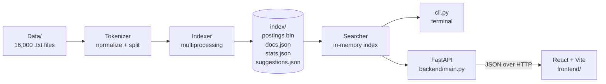

# खोज — Hindi Search Engine

An information-retrieval project that searches **16,000 Hindi economy news articles** with an **inverted index (posting lists)**. It can be used two ways:

- a **website** (React + FastAPI) with a Hindi virtual keyboard, suggestions, ranked results and a document popup with matches highlighted in yellow;
- a **terminal CLI** that prints the full ranked result list, the time taken and the number of documents searched.

Every search is answered in **well under 500 ms**. The worst case measured is about 43 ms, and a typical search takes under 1 ms (see [Performance](#performance)).

**Live website:** _coming soon (link will be added after deployment)_

How to install and run: see [how_to_run.md](how_to_run.md).

---

## Contents

1. [Features](#features)
2. [Architecture](#architecture)
3. [How search works](#how-search-works)
4. [Why it is fast](#why-it-is-fast)
5. [Performance](#performance)
6. [Tech stack](#tech-stack)
7. [Project structure](#project-structure)
8. [API reference](#api-reference)
9. [Testing](#testing)

---

## Features

| Requirement | Where |
|---|---|
| Search Hindi words over 16,000 `.txt` files in `Data/` | `engine/` (inverted index + searcher) |
| Results from the posting index in < 500 ms | measured with `scripts/benchmark.py` |
| Virtual Hindi keyboard when the search bar is clicked | `frontend/src/components/HindiKeyboard.jsx` |
| Suggested queries and words below the search bar | `frontend/src/components/Suggestions.jsx`, built by the indexer |
| Each document with the number of times the word appears | results table (website) and CLI |
| Total documents found, time taken in seconds | results summary (website) and CLI |
| Click a result to read the document with the word highlighted in yellow | `frontend/src/components/DocumentModal.jsx`, `cli.py :open` |
| Terminal interface with full result list, time and documents searched | `cli.py` |

Extras: autocomplete while typing, AND search for several words with an automatic OR fallback, nukta-insensitive matching (`बाज़ार` = `बाजार`), pagination, shareable search URLs, previous/next match in the popup, light and dark themes, mobile layout.

---

## Architecture



The work is split into an **offline** step and an **online** step:

1. **Offline — build the index once** (`python -m engine.indexer`, about 3.6 s).
   Every document is read, normalized and tokenized, and the term counts are merged into posting lists. The result is written to `index/`.
2. **Online — answer queries from memory.**
   `Searcher.load()` reads the index once (about 0.1–0.2 s). After that, a query never scans the documents: it only looks up posting lists in memory. The CLI and the FastAPI server both use the same `Searcher` class, so both give identical results.

Locally, the FastAPI server can also serve the built React app, so the whole site runs as one process. Online, the API runs as a Render Web Service and the React app as a Render Static Site (see [how_to_run.md](how_to_run.md#7-deployment-github--render)).

---

## How search works

### 1. Normalization and tokenization (`engine/tokenizer.py`)

The same function is used for documents and queries, so they always agree.

| Step | Why |
|---|---|
| Unicode **NFC** normalization | the same letter can be stored in different byte forms |
| Remove the **nukta** (`़`), e.g. `ज़्यादा` → `ज्यादा`, `बाज़ार` → `बाजार` | the corpus spells the same word both ways |
| Remove zero-width characters (ZWJ, ZWNJ, BOM) | invisible characters would split words |
| Lowercase Latin letters | `GDP` = `gdp` |
| Split with a regex into Devanagari words, Latin words and numbers | drops `।`, `॥`, quotes, brackets, commas and hyphens |

Stopwords (`के`, `में`, `है`, ...) are **not removed**. They stay searchable, and are only kept out of the suggestion chips.

### 2. Inverted index (`engine/indexer.py`)

```
term  ->  ( doc_ids: array('i') [3, 17, 42, ...],   sorted ascending
            tfs:     array('i') [2,  1,  5, ...] )   times the term occurs in that doc
```

- Files are sorted numerically (`Economy (2)` before `Economy (10)`) and given integer IDs `0 … 15999`.
- Documents are tokenized in parallel with `multiprocessing.Pool`. The results are consumed in order (`imap`), so each posting list is built already sorted by `doc_id`; no sort step is needed.
- `docs.json` stores the file name, title (first line) and length of each document; `stats.json` stores corpus statistics; `suggestions.json` stores the suggestion chips (curated economy words and sample queries, each checked to return results).

| Index statistic | Value |
|---|---|
| Documents | 16,000 |
| Tokens | 6,074,611 |
| Vocabulary (unique terms) | 28,469 |
| Postings (term, document pairs) | 2,936,261 |
| Index file size | 24.0 MB |
| Build time | ~3.6 s (15 worker processes; 23 s single-process) |

### 3. Query processing (`engine/searcher.py`)

1. Tokenize the query with the same rules and remove duplicate terms.
2. Look up each term's posting list in a Python `dict` (hash table, O(1)).
3. Combine the lists:
   - **one term:** its posting list is the answer;
   - **several terms (AND):** intersect the lists with a **two-pointer merge**, starting from the shortest list so the running result stays small. Cost is O(n + m) per merge;
   - **OR fallback:** if no document contains every term, or a term does not exist in the corpus, the lists are merged with a **k-way heap merge** (`heapq.merge`) and documents containing any term are returned. The response says which mode was used and which words were not found.
4. **Rank** by the total number of occurrences of the query terms in the document (sum of term frequencies), highest first; ties are broken by document ID.
5. Return only the requested **page** (25 rows on the website; everything in the CLI) together with the totals.

### 4. Highlighting

For the popup, `get_document()` reads the single requested file and returns the character offsets of every word whose normalized form matches a query term. Offsets point into the **original** text, so spelling variants such as `बाज़ार` are highlighted when searching `बाजार`. The browser wraps those ranges in yellow `<mark>` elements; the CLI uses ANSI colours.

### 5. Autocomplete

The vocabulary is kept as a sorted list. Words that start with the typed prefix form a contiguous range, found with two binary searches (`bisect`), then ordered by document frequency.

---

## Why it is fast

| Technique | Effect |
|---|---|
| **Offline indexing** | the 80 MB corpus is never scanned at query time |
| **Index held in memory** (~63 MB RAM) | no disk access per query |
| **Hash lookup** of posting lists | O(1) per query term |
| **Posting lists sorted by integer `doc_id`** in compact `array('i')` | linear-time merges, no sorting, small memory |
| **Shortest list first** in AND queries | the intersection shrinks as early as possible |
| **Early exit** when an intersection becomes empty | no wasted work |
| **LRU cache** (1,024 queries) on normalized terms | repeated queries return in ~0.2 ms |
| **Pagination** | only 25 result rows are serialized and sent to the browser |
| **orjson + gzip** in FastAPI | fast JSON encoding, small responses |
| **Index loaded once** at server start (`lifespan`) | no per-request setup |
| **Debounced autocomplete** (120 ms) and request cancellation in the browser | no flood of requests while typing |

---

## Performance

Measured on the development machine (Windows 11, Python 3.13) with `python scripts/benchmark.py`: 200 queries per suite, cache cleared before each suite so the numbers are uncached.

| Query type | Average | p95 | Max | < 500 ms |
|---|---|---|---|---|
| Single random word | 0.11 ms | 0.15 ms | 14.2 ms | yes |
| Single most frequent word (longest posting lists, e.g. `के`, `में`) | 1.7 ms | 5.8 ms | 25.7 ms | yes |
| 2 random words | 0.09 ms | 0.32 ms | 2.2 ms | yes |
| 3 frequent words (AND) | 6.5 ms | 11.1 ms | 12.1 ms | yes |
| 5 frequent words (AND) | 11.3 ms | 22.3 ms | 42.9 ms | yes |
| Unknown word | 0.01 ms | 0.02 ms | 0.10 ms | yes |
| Repeated query (cached) | 0.18 ms | | | yes |

Through HTTP (real uvicorn server, round trip including JSON and network stack), an average search takes **5–11 ms** and opening a document takes about **7 ms**.

Index load time at start-up: **0.1–0.2 s**. Memory used by the loaded index: **about 63 MB**.

---

## Tech stack

| Layer | Technology |
|---|---|
| Search engine | Python 3.10+ standard library: `re`, `unicodedata`, `array`, `heapq`, `bisect`, `functools.lru_cache`, `multiprocessing`, `pickle` |
| Backend | FastAPI, Uvicorn, orjson |
| Frontend | React 19, Vite 8, plain CSS (no UI framework) |
| Fonts | Tiro Devanagari Hindi (Hindi text), Hind (interface) from Google Fonts |
| Terminal | Python `argparse`, ANSI colours |
| Tests | Python `unittest` (39 tests), FastAPI `TestClient` |
| Deployment | GitHub + Render (Web Service for the API, Static Site for the frontend) |

No search library (Elasticsearch, Whoosh, Lucene, ...) is used; the index and all query algorithms are implemented in `engine/`.

---

## Project structure

```
IR/
├── Data/                     16,000 Hindi .txt documents (input)
├── engine/
│   ├── config.py             paths and file names
│   ├── tokenizer.py          normalization, tokenization, stopwords
│   ├── indexer.py            builds the inverted index  (python -m engine.indexer)
│   └── searcher.py           query processing, ranking, highlighting, autocomplete
├── index/                    generated index files (not committed)
├── backend/
│   └── main.py               FastAPI app (also serves frontend/dist)
├── frontend/
│   ├── index.html
│   ├── vite.config.js        dev server + /api proxy
│   └── src/
│       ├── App.jsx
│       ├── api.js
│       ├── styles.css
│       └── components/       SearchBar, HindiKeyboard, Suggestions, ResultsTable, DocumentModal
├── cli.py                    terminal interface
├── scripts/
│   ├── scan_corpus.py        corpus statistics
│   └── benchmark.py          latency benchmark
├── tests/                    unit + integration tests
├── requirements.txt
├── .python-version          Python version for Render
├── Phase.md                  implementation plan
├── progress.md               progress log
├── README.md
└── how_to_run.md
```

---

## API reference

Base URL: `http://127.0.0.1:8000`. Interactive docs are available at `/docs`.

| Method and path | Description |
|---|---|
| `GET /api/search?q=&page=1&size=20` | Ranked results page. Returns `total_docs`, `total_occurrences`, `docs_searched`, `time_sec`, `mode` (`single`, `and`, `or`, `none`), `missing_terms`, `page`, `pages`, `results[] {rank, doc_id, file, title, count}` |
| `GET /api/document/{doc_id}?q=` | Full text of one document plus `highlights` (`[start, end]` character offsets for `q`) |
| `GET /api/suggestions` | `{words: [{term, df}], queries: [...]}` |
| `GET /api/autocomplete?prefix=&limit=8` | Vocabulary words starting with the last word of `prefix` |
| `GET /api/stats` | Index statistics |
| `GET /api/health` | Status check |

Limits: `q` is 1–200 characters, `size` is 1–100; other values return HTTP 422.

---

## Testing

```bash
python -m unittest discover -s tests -t .
```

39 tests cover the tokenizer (nukta, zero-width characters, punctuation, matras), posting-list merges, highlight offsets, result counts checked against the raw files, ranking order, AND/OR behaviour, pagination, edge-case queries, the < 500 ms target, the CLI output and every API endpoint.

Notes on the corpus: numbers were removed from the source articles (for example `मार्च मेंप्रतिशत`), so searches for digits return no results, and a few words appear joined to a neighbour. Matching is on whole words, so `मुद्रास्फीतिप्रतिशत` is a separate term from `मुद्रास्फीति`.
